# Exploring SIRDS animations

## What are SIRDS
A single-image random-dot stereogram (SIRDS) is a type of [autostereogram](https://en.wikipedia.org/wiki/Autostereogram).
In a SIRDS, a three-dimensional scene is contained in one image (whereas [stereograms](https://en.wikipedia.org/wiki/Stereoscopy) use two).
The shape and depth information of the scene is expressed by a random dot pattern for each eye separately.
When viewed properly, the scene hidden in the image is revealed to the observer.
SIRDS are usually still, but a sequence of images may form an animated SIRDS (ASIRDS).
But what determines a successful ASIRDS?
We can do some highly subjective experiments to get a clue.
But let's start at the beginning.

## How to view a SIRDS

Let's take a simple image of a sphere. The grayscale values act like a depth map, where white is closest and black is farthest.

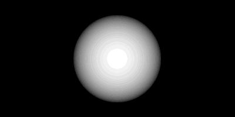

We then convert the image into a SIRDS.
There sphere can be seen again by letting the focal point of your eyesight move past the screen until the black dots overlap.
Let your eyes slowly adjust to the image. If you are wearing eyeglasses, taking them off might make this much easier.

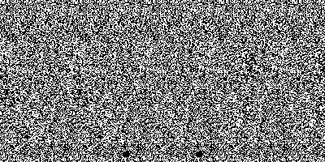

## Animating a SIRDS

We can animate the sphere by letting it move in a circular orbit.
To achieve this in a simple way, we let the both the radius of the sphere and its depth (i.e. grayness) depend on the distance.

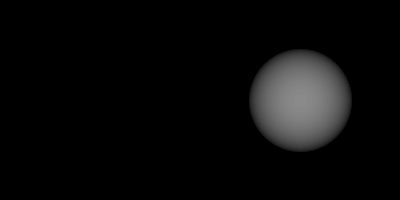

When converted to an animated SIRDS (ASIRDS), the result is a smoothly orbiting sphere with a convincing depth effect that is easy to follow.
This will be our reference image.

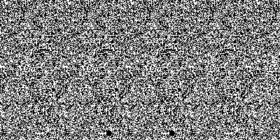

## Experiment 1: reusing the pattern

In the reference image, we generate a new random dot pattern for each frame.
This seems to be the norm for these type of animations.
But is that necessary?
What happens if we simply re-use the random dot pattern from the first frame, for all following frames?
Let's use the same starting image as before.

But now we re-use the pattern for each frame. The result is a calmer image where the sphere can still be seen moving.
However, background echos from the stereoscopic encoding technique seem to make it nearly impossible to track the sphere in 3D.

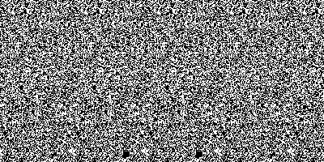

## Experiment 2: no depth scaling

What would happen if we disable the scaling of the grayscale depth values with distance?
The input image is similar to that of before, except the sphere is equally bright at all positions.

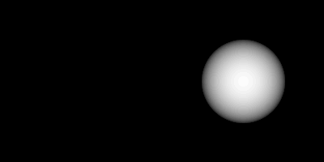

The result is at first glance similar to our reference image, but tracking the sphere with your eyes around its farthest point feels less natural and requires more effort.
So depth scaling is indeed important.

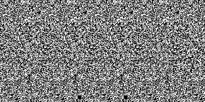

## Experiment 3: no size scaling

What happens if we disable distance scaling of the sphere's radius but leave depth scaling untouched?
Does the sphere's movement still appear as circular despite the lack of shape information?
The input image would look like this:

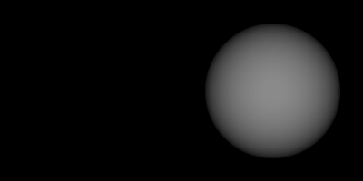

When viewed as an animated SIRDS, the animation is smooth and easy to follow.
However, instead of a clear circular orbit, the sphere seems to emerge from the background, move to the right, submerge into the background, and later re-appear on the left.

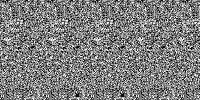

## Experiment 4: color vs monochrome

Would a colored ASIRDS be easier to view than a monochrome one?
Let's use the reference image from before.

Instead of the monochrome palette used so far, we can also use random RGB colors.
Is the resulting animation a better experience than the reference?
color somehow more bland, but also smoother.

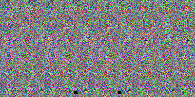

## Experiment 5: low vs normal resolution

Finally, would image resolution make a difference in viewing?
Again we use the reference image.

This time, we lower the resolution by copying every other pixel to its neighbouring position.
The image width and height do not change, but one pixel is now the size of four, and three are lost.
While the sphere is trackable, the depth effect is surprisingly awkward to view, as if you cannot focus properly.

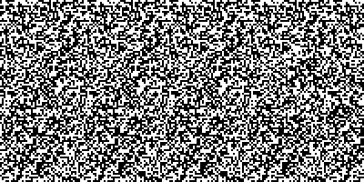

## Conclusion

A convincing animated SIRDS seems to depend on depth scaling proportional to object size, a fresh random dot pattern for each frame, and a high (or high enough) image resolution.
The color palette used does not seem to matter much.
These conclusions, based on only one input image and one observer, are obviously not scientific and should be regarded as pure conjecture.
